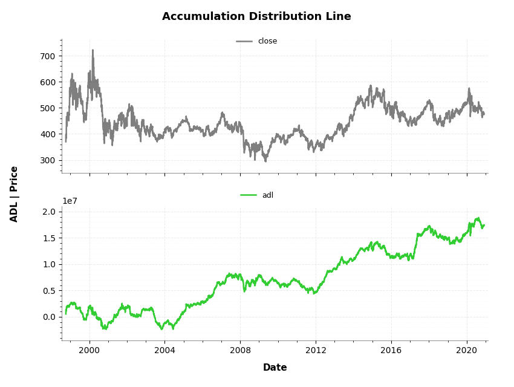
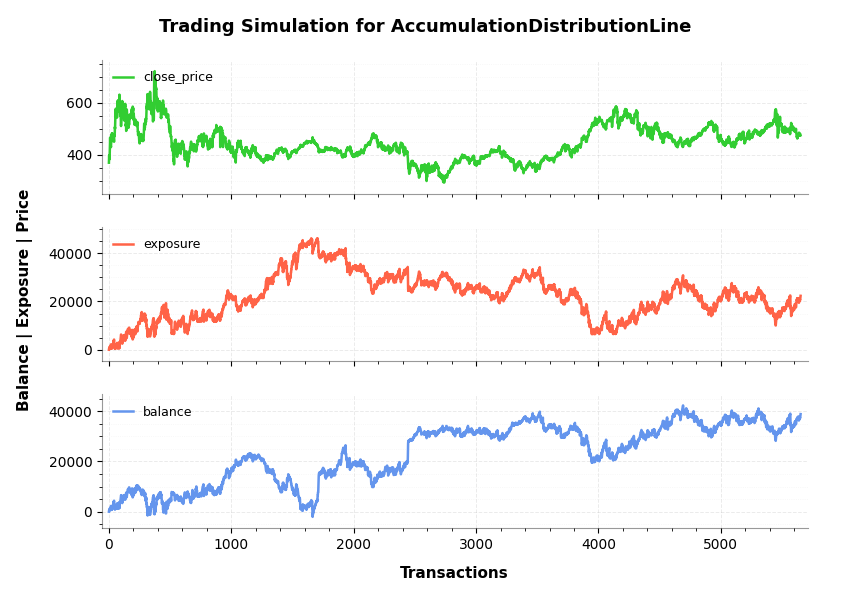

<p align="center"></p>

# Trading Technical Indicators (TTI)

<div align="center">

-yellow?style=for-the-badge)


**Modern Technical Analysis + Python + Machine Learning**

</div>

TTI is a Python library that brings together **traditional technical analysis** and **modern AI-driven tooling**.
It provides:

- **62 technical indicators**
- **Graph generation** for any indicator
- **Trading signal generation**
- **Trading simulation engine**
- **Machine Learning integration (coming soon!)**

> Built on *Technical Analysis from A to Z* by Steven B. Achelis. Validated against the *A to Z Companion Spreadsheet*.

---

## Installation & Documentation

**Full documentation:**
👉 https://trading-technical-indicators.readthedocs.io/en/latest

### Stable Release (0.2.2)
```bash
pip install tti
```

### Unreleased Development Version (0.3.x → 1.0.0)
```bash
git clone https://github.com/vsaveris/trading-technical-indicators.git
pip install .
```

---

## Under Development — Toward **v1.0.0**

<div align="center">


</div>

A full modernization of the project is underway:
- Python **3.11+** migration
- Dependency updates
- Packaging overhaul (`pyproject.toml`, pre-commit, CI)
- New ML forecasting pipeline
- Refactored & improved graphing engine

### Latest Dev Versions
- **0.3.2** — Improved graph generation
- **0.3.1** — Packaging / CI overhaul
- **0.3.0** — Major code refactor for modern dependencies

---

## Supported Indicators (62 total)

<details>
<summary><strong>Click to expand the full indicator list</strong></summary>

- Accumulation Distribution Line
- Average True Range
- Bollinger Bands
- Chaikin Money Flow
- Chaikin Oscillator
- Chande Momentum Oscillator
- Commodity Channel Index
- Detrended Price Oscillator
- Directional Movement Index
- Double Exponential Moving Average
- Ease Of Movement
- Envelopes
- Fibonacci Retracement
- Forecast Oscillator
- Ichimoku Cloud
- Intraday Movement Index
- Klinger Oscillator
- Linear Regression Indicator
- Linear Regression Slope
- Market Facilitation Index
- Mass Index
- Median Price
- Momentum
- Exponential Moving Average
- Simple Moving Average
- Time-Series Moving Average
- Triangular Moving Average
- Variable Moving Average
- MACD
- Negative Volume Index
- On Balance Volume
- Parabolic SAR
- Performance
- Positive Volume Index
- Price & Volume Trend
- Price Channel
- Price Oscillator
- Price Rate of Change
- Projection Bands
- Projection Oscillator
- Qstick
- Range Indicator
- Relative Momentum Index
- RSI
- RVI
- Standard Deviation
- Stochastic Momentum Index
- Stochastic Oscillators (fast/slow)
- Swing Index
- Time Series Forecast
- Triple EMA
- Typical Price
- Ultimate Oscillator
- VHF
- Volatility (Chaikin)
- Volume Oscillator
- Volume Rate of Change
- Weighted Close
- Wilder’s Smoothing
- Williams Accum/Distrib
- Williams %R

</details>

---

## Usage Example

```python
"""
Trading-Technical-Indicators (tti) python library

File name: indicator_example.py
    Example code for the trading technical indicators, for the docs.

Accumulation Distribution Line indicator and SCMN.SW.csv data file is used.
"""

import pandas as pd
from tti.indicators import AccumulationDistributionLine

# Read data from csv file. Set the index to the correct column
# (dates column)
df = pd.read_csv('./data/SCMN.SW.csv', parse_dates=True, index_col=0)

# Create indicator
adl_indicator = AccumulationDistributionLine(input_data=df)

# Get indicator's calculated data
print('\nTechnical Indicator data:\n', adl_indicator.getTiData())

# Get indicator's value for a specific date
print('\nTechnical Indicator value at 2012-09-06:', adl_indicator.getTiValue('2012-09-06'))

# Get the most recent indicator's value
print('\nMost recent Technical Indicator value:', adl_indicator.getTiValue())

# Get signal from indicator
print('\nTechnical Indicator signal:', adl_indicator.getTiSignal())

# Show the Graph for the calculated Technical Indicator
adl_indicator.getTiGraph().show()

# Execute simulation based on trading signals
simulation_data, simulation_statistics, simulation_graph = \
    adl_indicator.getTiSimulation(
        close_values=df[['close']], max_exposure=None,
        short_exposure_factor=1.5)
print('\nSimulation Data:\n', simulation_data)
print('\nSimulation Statistics:\n', simulation_statistics)

# Show the Graph for the executed trading signal simulation
simulation_graph.show()
```

---

**Output:**

```shell
Technical Indicator data:
                      adl
Date
1998-10-05  5.346066e+05
1998-10-06  9.788753e+05
1998-10-07  1.377338e+06
1998-10-08  1.251994e+06
1998-10-09  1.108012e+06
...                  ...
2020-11-30  1.736986e+07
2020-12-01  1.741746e+07
2020-12-02  1.737860e+07
2020-12-03  1.741683e+07
2020-12-04  1.742771e+07

[5651 rows x 1 columns]

Technical Indicator value at 2012-09-06: [8617026.854250321]

Most recent Technical Indicator value: [17427706.42639293]

Technical Indicator signal: ('buy', -1)

Simulation Data:
            signal open_trading_action  ... earnings  balance
Date                                   ...
1998-10-05   hold                none  ...        0        0
1998-10-06    buy                long  ...        0  385.138
1998-10-07    buy                long  ...   13.264  411.666
1998-10-08    buy                long  ...   13.264  777.644
1998-10-09    buy                long  ...   19.159  795.329
...           ...                 ...  ...      ...      ...
2020-11-30    buy                long  ...  19817.2  37577.2
2020-12-01   hold                none  ...  19817.2  37577.2
2020-12-02    buy                long  ...  19817.2  38019.2
2020-12-03    buy                long  ...  19817.2  38385.1
2020-12-04    buy                long  ...  19817.2  38837.2

[5651 rows x 7 columns]

Simulation Statistics:
 {
   'number_of_trading_days': 5651,
   'number_of_buy_signals': 4767,
   'number_of_ignored_buy_signals': 0,
   'number_of_sell_signals': 601,
   'number_of_ignored_sell_signals': 0,
   'last_stock_value': 475.5,
   'last_exposure': 22340.73,
   'last_open_long_positions': 40,
   'last_open_short_positions': 0,
   'last_portfolio_value': 19020.0,
   'last_earnings': 19817.21,
   'final_balance': 38837.21
}
```

<p align="center"> </p>
