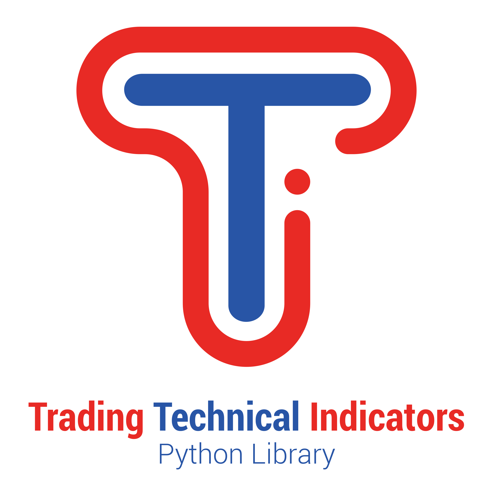

.. tti documentation master file, created by
   sphinx-quickstart on Sat Dec  5 14:10:27 2020.
   You can adapt this file completely to your liking, but it should at least
   contain the root `toctree` directive.

Welcome to the Trading Technical Indicators (tti) python documentation!
=======================================================================

.. toctree::
   :maxdepth: 1
   :caption: Contents:

   installation
   tti
   examples

Indices and tables
==================

* :ref:`genindex`

