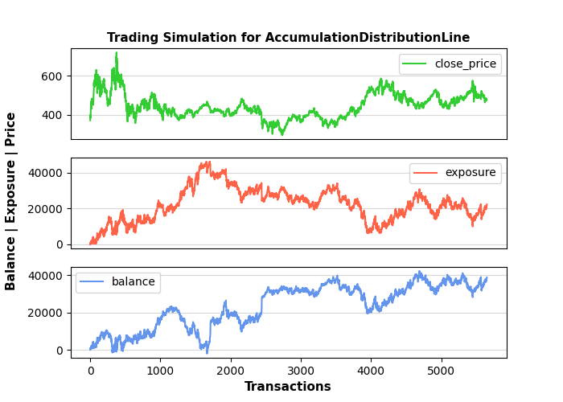

tti.indicators usage examples
=============================

Below is an example on how to use the ``tti.indicators`` package API. Accumulation Distribution Line indicator is used in this example, but similar usage applies for all the indicators. The only differences from other indicators usage are the required columns in the input data (Accumulation Distribution Line requires  ``close``, ``high``, ``low`` and ``volume`` columns) and the different input arguments which each indicator may have.

.. code-block:: bash
    :caption: Input data (part of them)

                   High        Low        close      Volume
    Date
    1998-10-05  388.084991  342.890991  369.908997  2732524.0
    1998-10-06  385.628998  371.382996  385.138000   477160.0
    1998-10-07  403.313995  377.769012  398.402008   647460.0
    1998-10-08  396.928009  376.295013  382.190002   292460.0
    1998-10-09  394.963013  386.119995  388.084991   259155.0

.. code-block:: python
    :caption: Usage example

    """
    Trading-Technical-Indicators (tti) python library

    File name: indicator_example.py
        Example code for the trading technical indicators, for the docs.

    Accumulation Distribution Line indicator and SCMN.SW.csv data file is used.
    """

    import pandas as pd
    from tti.indicators import AccumulationDistributionLine

    # Read data from csv file. Set the index to the correct column
    # (dates column)
    df = pd.read_csv('./data/SCMN.SW.csv', parse_dates=True, index_col=0)

    # Create indicator
    adl_indicator = AccumulationDistributionLine(input_data=df)

    # Get indicator's calculated data
    print('\nTechnical Indicator data:\n', adl_indicator.getTiData())

    # Get indicator's value for a specific date
    print('\nTechnical Indicator value at 2012-09-06:', adl_indicator.getTiValue('2012-09-06'))

    # Get the most recent indicator's value
    print('\nMost recent Technical Indicator value:', adl_indicator.getTiValue())

    # Get signal from indicator
    print('\nTechnical Indicator signal:', adl_indicator.getTiSignal())

    # Show the Graph for the calculated Technical Indicator
    adl_indicator.getTiGraph().show()

    # Save the Graph for the calculated Technical Indicator
    adl_indicator.getTiGraph().savefig('./figures/example_AccumulationDistributionLine.png')
    print('\nGraph for the calculated ADL indicator data, saved.')

    # Execute simulation based on trading signals
    simulation_data, simulation_statistics, simulation_graph = \
        adl_indicator.getTiSimulation(
            close_values=df[['close']], max_exposure=None,
            short_exposure_factor=1.5)
    print('\nSimulation Data:\n', simulation_data)
    print('\nSimulation Statistics:\n', simulation_statistics)

    # Save the Graph for the executed trading signal simulation
    simulation_graph.savefig('./figures/simulation_AccumulationDistributionLine.png')
    print('\nGraph for the executed trading signal simulation, saved.')

.. code-block:: bash
    :caption: Output of the above example

    Technical Indicator data:
                        adl
    Date
    1998-10-05  5.346066e+05
    1998-10-06  9.788753e+05
    1998-10-07  1.377338e+06
    1998-10-08  1.251994e+06
    1998-10-09  1.108012e+06
    ...                  ...
    2020-11-30  1.736986e+07
    2020-12-01  1.741746e+07
    2020-12-02  1.737860e+07
    2020-12-03  1.741683e+07
    2020-12-04  1.742771e+07

    [5651 rows x 1 columns]

    Technical Indicator value at 2012-09-06: [8617026.854250321]

    Most recent Technical Indicator value: [17427706.42639293]

    Technical Indicator signal: ('buy', -1)

    Graph for the calculated ADL indicator data, saved.

    Simulation Data:
                signal open_trading_action  ... earnings  balance
    Date                                   ...
    1998-10-05   hold                none  ...        0        0
    1998-10-06    buy                long  ...        0  385.138
    1998-10-07    buy                long  ...   13.264  411.666
    1998-10-08    buy                long  ...   13.264  777.644
    1998-10-09    buy                long  ...   19.159  795.329
    ...           ...                 ...  ...      ...      ...
    2020-11-30    buy                long  ...  19817.2  37577.2
    2020-12-01   hold                none  ...  19817.2  37577.2
    2020-12-02    buy                long  ...  19817.2  38019.2
    2020-12-03    buy                long  ...  19817.2  38385.1
    2020-12-04    buy                long  ...  19817.2  38837.2

    [5651 rows x 7 columns]

    Simulation Statistics:
    {'number_of_trading_days': 5651,
     'number_of_buy_signals': 4767,
     'number_of_ignored_buy_signals': 0,
     'number_of_sell_signals': 601,
     'number_of_ignored_sell_signals': 0,
     'last_stock_value': 475.5,
     'last_exposure': 22340.73,
     'last_open_long_positions': 40,
     'last_open_short_positions': 0,
     'last_portfolio_value': 19020.0,
     'last_earnings': 19817.21,
     'final_balance': 38837.21}

    Graph for the executed trading signal simulation, saved.

Graph output from the ``getTiGraph()`` function call.

.. image:: ./images/example_AccumulationDistributionLine.png
    :align: center
    :width: 400px

Graph output returned by the ``getTiSimulation()`` function call.

