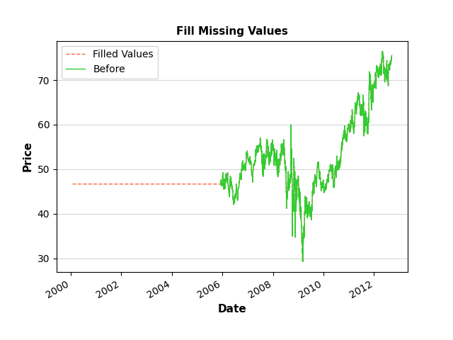
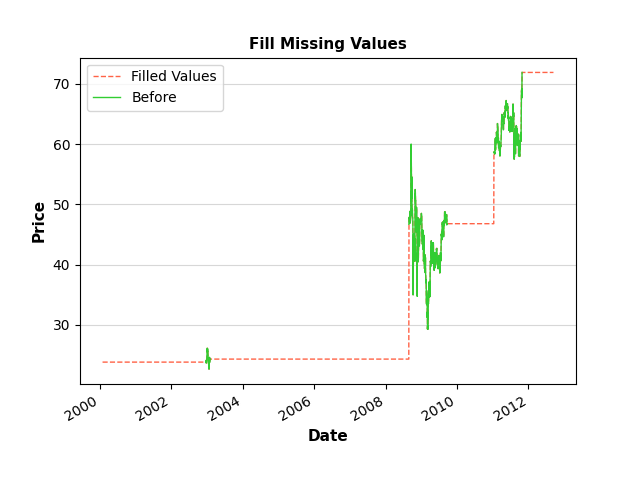

tti.utils usage examples
========================

Below is an example on how to use the ``fillMissingValues`` function of the ``tti.utils`` package.

.. code-block:: python
    :caption: Usage example

    """
    Trading-Technical-Indicators (tti) python library

    File name: utils_example.py
        Example code for the Fill Missing Values function.

    Data files used:
    - example_data_missing_1.csv: Missing data at the beginning of the file.
    - example_data_missing_1.csv: Missing data at the end of the file.
    - example_data_missing_1.csv: Missing data at several places in the file.
    """

    import pandas as pd
    import matplotlib.pyplot as plt
    from tti.utils import fillMissingValues

    for data_file in ['example_data_missing_1.csv', 'example_data_missing_2.csv',
                    'example_data_missing_3.csv']:

        # Read data from csv file. Set the index to the correct column
        df = pd.read_csv('./data/' + data_file, parse_dates=True, index_col=0)

        # Fill missing values using the fillMissingValues exposed function
        filled_df = fillMissingValues(df)

        # Create a dataframe with original and modified values, for plotting the
        # changes

        df = pd.concat([filled_df, df], axis=1)
        df.columns = ['After', 'Before']

        # Plot the updates on the data
        plt.plot(df.index, df['After'], label='Filled Values', color='tomato',
                linestyle='--', linewidth=1, alpha=1.0)
        plt.plot(df.index, df['Before'], label='Before', color='limegreen',
                linestyle='-', linewidth=1, alpha=1.0)
        plt.grid(which='major', axis='y', alpha=0.5)
        plt.xlabel('Date', fontsize=11, fontweight='bold')
        plt.ylabel('Price', fontsize=11, fontweight='bold')
        plt.title('Fill Missing Values', fontsize=11, fontweight='bold')
        plt.gcf().autofmt_xdate()
        plt.legend(loc=0)
        plt.savefig('./figures/' + data_file.split('.')[0] + '.png')
        plt.clf()

        print('- Graph', './figures/' + data_file.split('.')[0] + '.png', 'saved.')

Result after filling the missing data at the beginning of a file.

Result after filling the missing data at the end of a file.

.. image:: ./images/example_data_missing_2.png
    :align: center
    :width: 400px

Result after filling the missing data at several places of a file.

